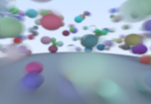

# Breaking Walls

A cozy float-in-space game with cutting edge graphics.

  - Players interact with and dodge obstacles using deterministic physics
  - Zen mode that includes maintaining balance in a procedurally generated open world
  - Simple event handling (mouse, touch, keyboard) and haptic feedback
  - Performance goal-seeking mode with points given to obstacles avoided
  - Spatialized sound effects
  - Break down the 4th wall and advance into evolving worlds with online gameplay

## Configuration

[CMake](https://cmake.org) is used for project configuration.

These exteneral dependencies are downloaded with CMake and Git:

  * `git clone https://github.com/zmertens/BreakingWalls.git --shallow-submodules`

  * `cmake --preset="platform: build-msvc"` **(this will automatically download the following dependencies)**

    - [box2d](https://box2d.org/documentation/hello.html)
    - [glm](https://github.com/g-truc/glm)
    - [Maze Builder](https://zmertens.github.io/mazebuilder.github.io/index.html)
    - [SDL](https://libsdl.org)
    - [SFML](https://sfml-dev.org)

