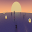

# Breaking Walls

An endless runner with synthwave feels and cutting edge graphics.

  - Players interact with and dodge obstacles using deterministic physics
  - Zen mode that includes **just running mode**.
  - Simple event handling (mouse, touch, keyboard) and haptic feedback
  - Spatialized sound effects
  - Break down the 4th wall and advance into evolving worlds with online gameplay

## Configuration

[CMake](https://cmake.org) is used for project configuration.

These exteneral dependencies are downloaded automatically with CMake and Git:

- [box2d](https://box2d.org/documentation/hello.html)
- [glm](https://github.com/g-truc/glm)
- [Maze Builder](https://zmertens.github.io/mazebuilder.github.io/index.html)
- [SDL](https://libsdl.org)
- [SFML](https://sfml-dev.org)

Clone the repository:
`git clone https://github.com/zmertens/BreakingWalls.git --shallow-submodules`

Configure the project on Windows:
`cmake --preset="platform: build-msvc"`
